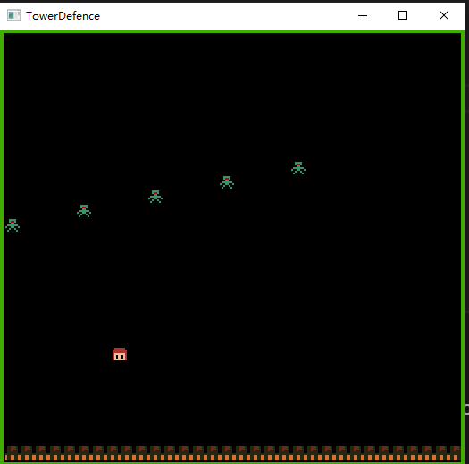

# (Tower Defence)

Author: (Meng Wei)

Design: (Me as the player are trying to protect my tower from the zombies. When I hit the zombie, it moves backward for some distance so that it cannot reach my tower)

Screen Shot:

How Your Asset Pipeline Works:

1. After put the source files into the project by creating a folder called Asset, I can load the file into the game by using the function in load_save_png.cpp. The data(color) are stored in a u8vec4 type vector, which we will have to store the information to the tile using PPU466.
2. I am creating the Palette manually, by entering the RGBA color code.
3. Parse the color into the Tile. This part was inspired by Jacky Sun, and I have referenced my code. 
    - Translating the value stores in vector data into tiles, by comparing the RGBA value of each color of the Palette. If the color is the same, store the 'location'(00,01,10,11) of the color in the Palette to the tile(for example, if the color is at the location of '00' in the Palette, 0 will be stored in bit0 and the other 0 will be stored in bit1). 
    - Use bitewise operation to get the exact value(since it is a 8bit integer)
        - e.g. zombieTile.bit0[i] &= ~(1 << j);   i:rows    j:cols
4. after load all the source files through PPU466, I will draw it to the window. Draw each of the source files as sprite and set values.
5. do some gameplay work in the Update function.

Source file: [link](Asset/zombie_test.png) [link](Asset/player.png) [link](Asset/tower.png)

How To Play:

(TODO: describe the controls and (if needed) goals/strategy.)

This game was built with [NEST](NEST.md). 

You as a human are trying to protect your tower(?) from the zombies. 
Control: Up, Down, Left, Right
Note: Do not enter any of the keys other than the four arrow key.

When you hit(touch) the zombie, it moves backward so that it cannot reach your tower. Your goal is to defend the zombie and keep the zombie from your tower.

BUG: As you are trying to hit the other zombies, the one that you hit before will jump back to the original place.

